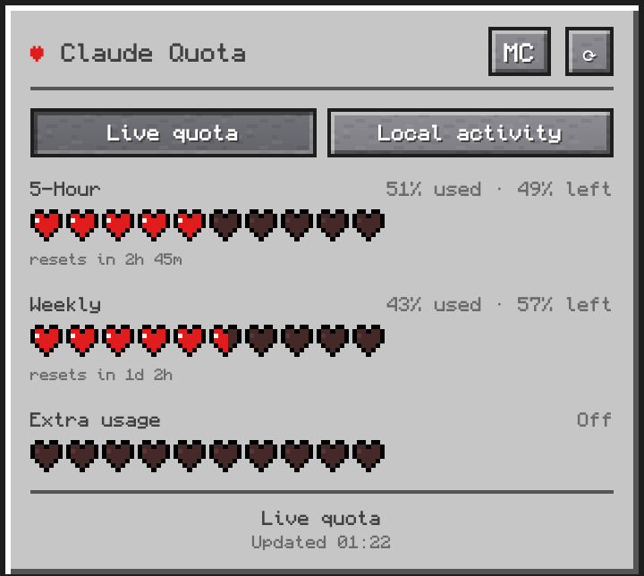
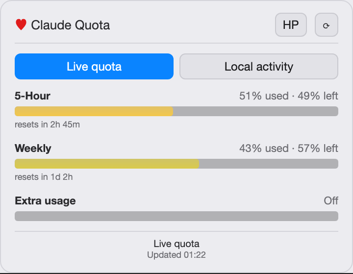
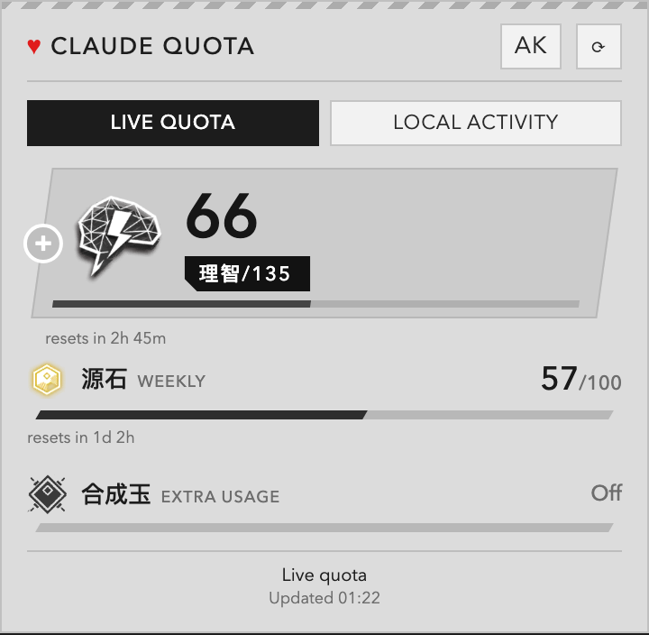
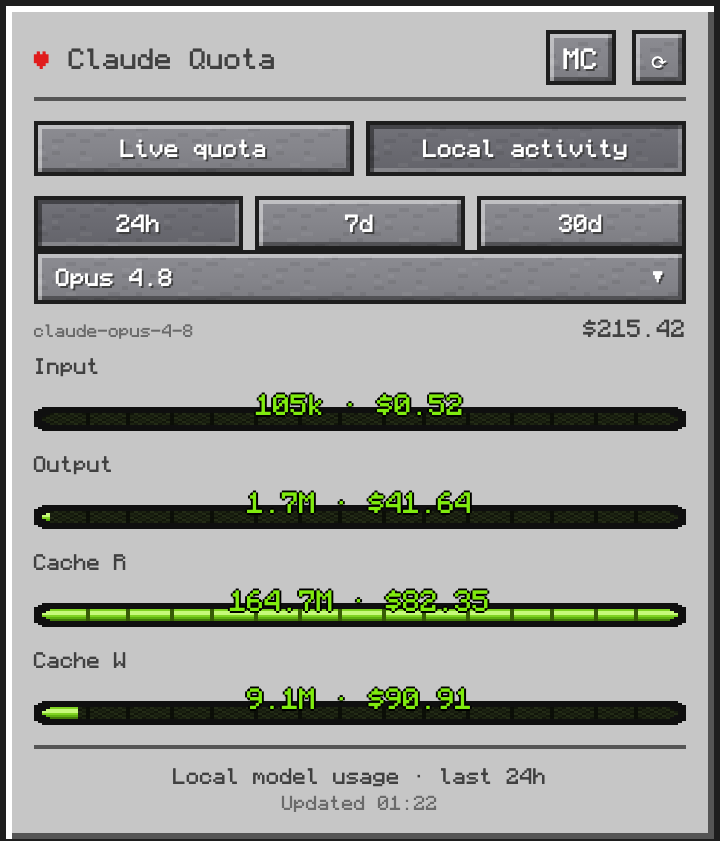
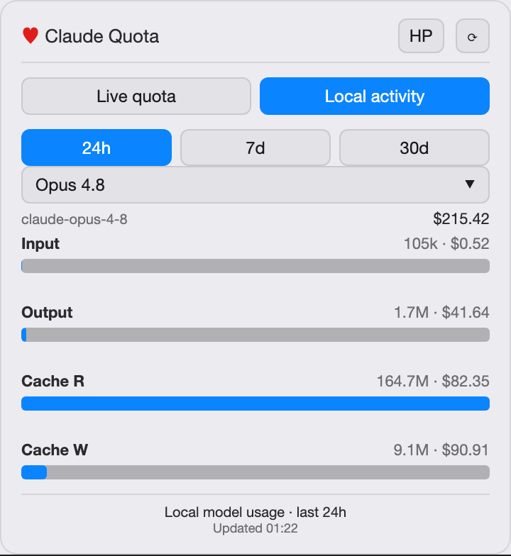
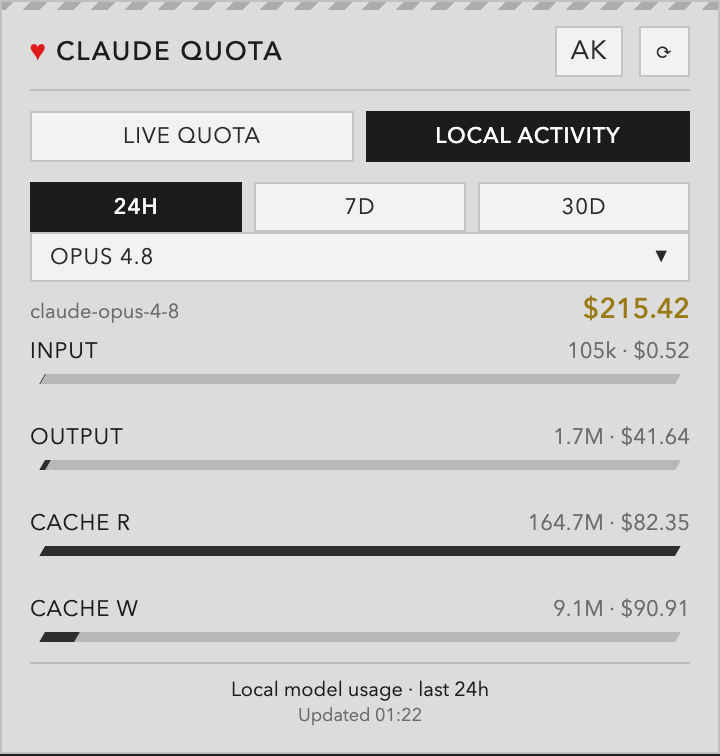

<div align="center">

# ♥ HPBar

**Your Claude and Codex usage, as a health bar in the menu bar / system tray.**

**把你的 Claude 与 Codex 用量，做成菜单栏 / 系统托盘里的一条血条。**

Cross-platform (macOS · Linux · Windows) · Tauri 2 · tiny (~6 MB)

**English** · [中文](#zh)

<br/>

<table>
  <tr>
    <td align="center"><b>Minecraft</b></td>
    <td align="center"><b>Classic</b></td>
    <td align="center"><b>Arknights</b></td>
  </tr>
  <tr>
    <td></td>
    <td></td>
    <td></td>
  </tr>
  <tr>
    <td></td>
    <td></td>
    <td></td>
  </tr>
</table>

<sub>Top: live quota — draining Minecraft hearts · classic green→red HP ramp · Arknights 理智 / 源石 readout.<br/>Bottom: local activity — per-model token &amp; cost breakdown. Switch themes any time.</sub>

</div>

---

<a id="en"></a>

## ✨ Features

- **Lives in the menu bar / tray.** A ♥ icon; click for the popover, right-click for the menu. No window, no Dock icon.
- **A living menu-bar heart** — the tray ♥ *is* the gauge: it drains with your most-depleted live window, **in whichever theme you've picked** (Minecraft red · Classic's green→amber→red HP ramp · Arknights 理智 azure), so you read your HP at a glance without clicking. When you're low it also shows the exact `%` beside it (macOS), which stays legible on any wallpaper.
- **Live quota** — every window the provider currently reports (5-hour where present, weekly, per-model weekly, extra usage), with reset countdowns. Codex also shows local credit / spend-control details when its log contains them; HPBar does not invent a removed window.
- **Burn-rate warning** — when your recent pace would exhaust a window *before* it resets, the bar flags **⚠ hits limit in ~35m**, so a surprise rate-limit doesn't catch you mid-task.
- **This machine vs other devices** — your subscription is account-wide, but the Live bars *estimate* how much of each window **this** machine is using vs everything else (another laptop, claude.ai, the mobile app), shown as a dimmed "ghost" split on the bar plus a `This machine ~28% · Others ~12%` line. It fits the relationship between account-wide utilization and this machine's local cost (both Claude and Codex meter by model-weighted cost); an optional **Only Device Here** tray toggle calibrates it. Hidden until the fit is confident. How it works + how fast it converges: [docs/usage-fitting.md](docs/usage-fitting.md).
- **Quota alerts** — an opt-out native notification the first time a window goes low / critical (toggle in the tray menu).
- **Local activity** — per-model token + cost breakdown from local Claude Code, Codex, and OpenClaw session logs over 24h / 7d / 30d, plus a **top-projects** breakdown (which repo ate your tokens) in the pooled "All" view.
- **Opt-in Team billing view** — share aggregate usage through your own SSH-accessible Postgres. Each installation remains a distinct member even when people share a login; the **犯罪记录 / Crime records** drill-down shows member → account → model usage and bill-split percentages. Account labels can be masked, fully shown, or hidden. Rolling upgrades keep legacy members visible (clearly marked, without pretending their old logs have account attribution) until they upgrade.
- **Three switchable themes**, remembered across launches:
  | Theme | Live quota | Local activity |
  |-------|-----------|----------------|
  | 🟩 **Minecraft** | draining pixel hearts | Bedrock-style XP bars |
  | 🍏 **Classic** | green→yellow→red HP ramp | neutral magnitude bars |
  | 🎮 **Arknights** | 理智 (Sanity) hero plate · 源石 · 合成玉 | skewed game-UI bars |
- **Open at Login** toggle in the tray menu.
- **Tiny & native** — uses each OS's built-in webview (no bundled Chromium), so installers are ~3–6 MB and idle RAM stays near a native app's.

## 📦 Install

Pre-built bundles are attached to each [release](../../releases) (tags like `tauri-v0.1.1`). They are **unsigned**, so every OS shows an "unidentified developer" warning on first launch — how to get past each is below.

HPBar reads the token from your existing Claude Code login, so **sign in with the Claude Code CLI first** (`claude`). Then look for the ♥ in your menu bar / tray.

<details open>
<summary><b>macOS</b> — <code>.dmg</code></summary>

1. Download `HPBar_<version>_universal.dmg` (Intel + Apple Silicon), open it, drag **HPBar** to Applications.
2. First launch is blocked by Gatekeeper (unsigned). Do one of:
   - **Right-click** HPBar.app → **Open** → **Open**, or
   - `xattr -dr com.apple.quarantine /Applications/HPBar.app`, or
   - after the block: System Settings → Privacy & Security → **Open Anyway**.
3. **On notched Macs**, a crowded menu bar can hide the ♥ *behind the notch* — hold **⌘ and drag** menu-bar icons to reorder (or use [Ice](https://github.com/jordanbaird/Ice) / Bartender) to surface it.

</details>

<details>
<summary><b>Linux</b> — <code>.deb</code> / <code>.rpm</code> / <code>.AppImage</code></summary>

Needs a webkit2gtk 4.1 runtime and an AppIndicator-style tray.

```sh
# Debian / Ubuntu
sudo apt install ./HPBar_<version>_amd64.deb
# (deps if missing) sudo apt install libwebkit2gtk-4.1-0 libayatana-appindicator3-1

# Fedora / RHEL
sudo dnf install ./HPBar-<version>-1.x86_64.rpm

# AppImage (any distro)
chmod +x HPBar_<version>_amd64.AppImage && ./HPBar_<version>_amd64.AppImage
```

GNOME needs the [AppIndicator extension](https://extensions.gnome.org/extension/615/appindicator-support/) for the tray icon. Token is read from `~/.claude/.credentials.json` — **no prompt**.

</details>

<details>
<summary><b>Windows</b> — <code>.msi</code> / <code>.exe</code></summary>

1. Run `HPBar_<version>_x64-setup.exe` (NSIS) or `HPBar_<version>_x64_en-US.msi`.
2. Unsigned → SmartScreen shows "Windows protected your PC": **More info → Run anyway**.
3. Needs the **WebView2 runtime** — preinstalled on Windows 11; the installer pulls it in on Windows 10.

Token is read from `%USERPROFILE%\.claude\.credentials.json` — **no prompt**.

</details>

## 🔑 Where the token comes from

| OS | Source | Prompt? |
|----|--------|---------|
| macOS | Keychain item `Claude Code-credentials`, read via `/usr/bin/security` — the same tool Claude Code stores it with, so the item already trusts it | **never** |
| Linux / Windows | `~/.claude/.credentials.json` plaintext file (Claude Code uses no OS keyring on either) | **never** |

`$CLAUDE_CONFIG_DIR` is honoured everywhere Claude Code honours it — the
credentials file and session logs move with it.

HPBar never logs in itself — it reuses your Claude Code login and **only reads**
it: it never writes the item, never deletes it, and never refreshes the token
(refreshing would rotate the CLI's refresh token and log you out for real). It
also reads as rarely as it can — only once Claude Code has actually written a
new token. Why that matters, and how it's enforced:
[docs/credential-access.md](docs/credential-access.md).

## 🛠 Develop

Prereqs: Node + npm, and the Rust toolchain (`rustup`).

```sh
npm install
npm run tauri dev      # tray app with hot-reload
npm run tauri build    # .dmg / .deb+.rpm+.AppImage / .msi+.exe
```

If `cargo` downloads fail with an HTTP/2 framing error: `CARGO_HTTP_MULTIPLEXING=false npm run tauri dev`.
Headless data-path checks (no GUI): `cargo run --example check` (live) · `cargo run --example local_check` (local).

**Theme showcase / mock mode** — preview every theme with canned data; no Keychain, no network, no Tauri:

```sh
npm run dev    # vite only, then open in a browser:
```

- Gallery of all themes × tabs: <http://localhost:1420/showcase.html>
- A single panel: `http://localhost:1420/?mock=1&theme=arknights&source=team&crime=1`
  (`theme` = `minecraft` \| `classic` \| `arknights`, `source` = `live` \| `local` \| `team`, `provider` = `claude` \| `codex`)

These screenshots were captured this way.

<details>
<summary>Project layout</summary>

```
src/                    Frontend (vanilla TS + Vite)
  hearts.ts             Minecraft hearts (pixel-grid SVG)
  xpbar.ts              Minecraft XP bars
  classicbar.ts         Classic HP/neutral bars
  arknights.ts          理智/源石/合成玉 rows + sanity hero plate
  theme.ts              theme state (persisted, body.theme-<id>)
  mock.ts               canned data for the showcase/test mode
  main.ts               state, fetch, render dispatch
public/ak/              Arknights icon assets
showcase.html           theme gallery (mock mode)
src-tauri/src/
  credentials.rs        read Claude Code token (Keychain / file)
  usage.rs              GET /api/oauth/usage
  localstats.rs         scan ~/.claude/projects + pricing.rs
  codexstats.rs         scan ~/.codex/sessions for usage + quota
  account.rs            local account epochs for honest historical attribution
  team/                  opt-in Postgres sync + member/account/model reports
  heart_icon.rs         rasterise the live-HP tray heart (RGBA, no deps)
  burn.rs               burn-rate → "hits limit before reset?" (pure math)
  share.rs              device-share fit (this machine vs other devices) + persistence
  ambient.rs            background poll: live tray icon + % title + alerts + history
  lib.rs                tray, popover window, commands
  examples/tray_preview.rs   dev aid: render the tray heart at every level to a PNG
```

</details>

## 📝 Status

Three themes complete and verified on macOS; Linux/Windows bundles build in CI. Not yet done: code signing/notarization. The Arknights icon assets are sourced from community wikis and bundled for this app.

**Platform notes for the live heart.** The draining/colour-changing tray icon, quota alerts, and the burn-rate warning are cross-platform. Two pieces are macOS-specific by design: the inline `%` annunciator (the tray *title* is unsupported on Windows and inconsistent on Linux) and template handling. The trade-off works out — only macOS's menu-bar vibrancy can wash the icon's hue, and that's exactly where the `%` title fills in; Windows and Linux render the heart's colour faithfully. The icon + alerts are verified on macOS; the Win/Linux paths are correct-by-construction (Tauri no-ops the macOS-only calls) but not yet run on those OSes.

---
<br/>

<a id="zh"></a>

<div align="center">

# ♥ HPBar · 中文

**把你的 Claude 订阅用量，做成菜单栏 / 系统托盘里的一条血条。**

跨平台（macOS · Linux · Windows）· 基于 Tauri 2 · 体积小（约 6 MB）

[English](#en) · **中文**

</div>

## ✨ 功能

- **常驻菜单栏 / 托盘**：一个 ♥ 图标，左键点开弹窗，右键打开菜单；没有窗口，也没有 Dock 图标。
- **会动的菜单栏血条**：托盘上的 ♥ 本身就是血条——它会随你「最吃紧」的实时额度逐格扣血，并**按你选择的主题着色**（我的世界红 · 经典 绿→黄→红 血条 · 明日方舟 理智蓝），不点开也能一眼看出血量；额度偏低时还会在旁边显示精确的 `%`（macOS），任何壁纸下都清晰可读。
- **实时额度（Live quota）**：动态显示服务商当前实际提供的额度窗口（存在时显示 5 小时、每周、按模型周额度、额外用量等）及重置倒计时；Codex 日志若含 credits / spend-control 信息也会展示，不会凭空补一个已经取消的 5 小时窗口。
- **耗尽预警（Burn-rate）**：当按你最近的用量速度、某个窗口会在重置**之前**就被用光时，血条会标出 **⚠ 约 35m 后触顶**，免得任务进行到一半被突然限流。
- **本机 vs 其他设备**：订阅是全账号共享的，但「实时额度」会*估算*每个窗口里有多少是**本机**用掉的，相对其他来源（另一台电脑、claude.ai、手机 App），在血条上以暗色「虚影」分段显示，并附一行 `本机 ~28% · 其他 ~12%`。原理是拟合「全账号用量」与「本机花费」的关系（Claude 与 Codex 都按模型加权的 token 成本计量）；托盘里可选的 **仅此设备** 开关用于校准。拟合不够确定时自动隐藏。
- **额度提醒（Quota alerts）**：窗口首次进入「偏低 / 临界」时弹一条系统通知（默认开启，托盘菜单可关）。
- **本地活动（Local activity）**：从本地 Claude Code、Codex 与 OpenClaw 会话日志统计每个模型的 token 用量与估算花费，支持 24 小时 / 7 天 / 30 天；在汇总的「All」视图下还会按**项目排名**（「哪个仓库吃了我的 token」）。
- **可选 Team 分账**：通过你自己的 SSH + Postgres 同步汇总数据。即便多人共用登录，每个安装仍是独立成员；「**犯罪记录**」下钻展示成员 → 账号 → 模型明细与分摊比例，账号标签可选掩码、完整或隐藏。滚动升级期间仍显示旧版成员并明确标记，但不会假装旧日志具有不存在的账号归属。
- **三种可切换主题**（自动记住上次选择）：
  | 主题 | 实时额度 | 本地活动 |
  |------|---------|---------|
  | 🟩 **我的世界** | 逐格扣血的像素红心 | 基岩版风格经验条 |
  | 🍏 **经典** | 绿→黄→红 血条渐变 | 单色用量条 |
  | 🎮 **明日方舟** | 理智读数 · 源石 · 合成玉 | 斜切游戏 UI 进度条 |
- 托盘菜单内可开启 **开机自启**。
- **小巧且原生**：复用各系统自带的 webview（不打包 Chromium），安装包仅约 3–6 MB，空闲内存接近原生应用。

## 📦 安装

每个 [release](../../releases) 都附带预编译安装包（标签形如 `tauri-v0.1.1`）。安装包**未签名**，首次启动时系统会提示「未受信任的开发者」，各平台绕过方法见下。

HPBar 复用你已有的 Claude Code 登录，请**先用 Claude Code CLI 登录**（`claude`），随后在菜单栏 / 托盘找到 ♥ 图标。

<details open>
<summary><b>macOS</b> — <code>.dmg</code></summary>

1. 下载 `HPBar_<version>_universal.dmg`（同时支持 Intel 与 Apple 芯片），打开后把 **HPBar** 拖入「应用程序」。
2. 首次启动会被 Gatekeeper 拦截（未签名），任选其一：
   - **右键**点 HPBar.app → **打开** → **打开**；或
   - 终端执行 `xattr -dr com.apple.quarantine /Applications/HPBar.app`；或
   - 被拦截后到「系统设置 → 隐私与安全性」点 **仍要打开**。
3. **刘海屏 Mac**：菜单栏图标过多时 ♥ 可能被藏在*刘海后面* —— 按住 **⌘ 拖动**菜单栏图标重新排列即可让它显示出来（或用 [Ice](https://github.com/jordanbaird/Ice) / Bartender 管理）。

</details>

<details>
<summary><b>Linux</b> — <code>.deb</code> / <code>.rpm</code> / <code>.AppImage</code></summary>

需要 webkit2gtk 4.1 运行库，以及支持 AppIndicator 的托盘。

```sh
# Debian / Ubuntu
sudo apt install ./HPBar_<version>_amd64.deb

# Fedora / RHEL
sudo dnf install ./HPBar-<version>-1.x86_64.rpm

# AppImage（任意发行版）
chmod +x HPBar_<version>_amd64.AppImage && ./HPBar_<version>_amd64.AppImage
```

GNOME 需要安装 [AppIndicator 扩展](https://extensions.gnome.org/extension/615/appindicator-support/)才会显示托盘图标。令牌从 `~/.claude/.credentials.json` 读取，**不会弹窗**。

</details>

<details>
<summary><b>Windows</b> — <code>.msi</code> / <code>.exe</code></summary>

1. 运行 `HPBar_<version>_x64-setup.exe`（NSIS）或 `HPBar_<version>_x64_en-US.msi`。
2. 未签名 → SmartScreen 提示「Windows 已保护你的电脑」：点 **更多信息 → 仍要运行**。
3. 需要 **WebView2 运行时** —— Windows 11 已自带；Windows 10 上安装程序会自动拉取。

令牌从 `%USERPROFILE%\.claude\.credentials.json` 读取，**不会弹窗**。

</details>

## 🔑 令牌来源

| 系统 | 来源 | 是否弹窗 |
|------|------|---------|
| macOS | 钥匙串项 `Claude Code-credentials`，通过 `/usr/bin/security` 读取 —— 这正是 Claude Code 自己写入该项所用的工具，钥匙串本就信任它 | **从不** |
| Linux / Windows | `~/.claude/.credentials.json` 明文文件（这两个平台上 Claude Code 都不使用系统钥匙串） | **从不** |

如果设置了 `$CLAUDE_CONFIG_DIR`，HPBar 会跟随该目录（凭据文件与会话日志都在其中）。

HPBar 自身不做任何登录，只复用你的 Claude Code 登录信息，并且**只读**：从不写入、
从不删除，也从不刷新令牌（刷新会轮换 CLI 的 refresh token，真的把你登出）。读取频率
也压到最低 —— 只有当 Claude Code 确实写入了新令牌时才会去读。原因与具体保障见
[docs/credential-access.md](docs/credential-access.md)。

## 🛠 开发

依赖：Node + npm，以及 Rust 工具链（`rustup`）。

```sh
npm install
npm run tauri dev      # 带热重载的托盘应用
npm run tauri build    # 打包各平台安装包
```

若 `cargo` 下载报 HTTP/2 framing 错误，加前缀：`CARGO_HTTP_MULTIPLEXING=false npm run tauri dev`。

**主题预览 / mock 模式** —— 用预置假数据预览所有主题，无需钥匙串、网络或 Tauri：执行 `npm run dev`（仅 vite），然后在浏览器打开 <http://localhost:1420/showcase.html>（所有主题画廊），或 `http://localhost:1420/?mock=1&theme=arknights&source=team&crime=1` 查看 Team「犯罪记录」面板。本文档的截图即由此生成。

## 📝 状态

三种主题均已完成并在 macOS 上验证；Linux/Windows 安装包由 CI 构建。尚未完成：代码签名 / 公证。明日方舟主题图标来自社区 wiki，随应用一并打包。

**关于「会动的血条」的平台说明。** 会扣血 / 变色的托盘图标、额度提醒、耗尽预警都是跨平台的。有两处是特意只在 macOS 生效：旁边的 `%` 读数（托盘**标题**在 Windows 不支持、在 Linux 表现不一）以及 template（模板图标）处理。这个取舍正好合适——只有 macOS 的菜单栏 vibrancy 会把图标颜色冲淡，而那正是 `%` 读数补位的地方；Windows 与 Linux 会如实显示血条颜色。图标 + 提醒已在 macOS 验证；Win/Linux 路径在代码层面是正确的（Tauri 会把 macOS 专有调用变为空操作），但尚未在这两个系统上实跑。
